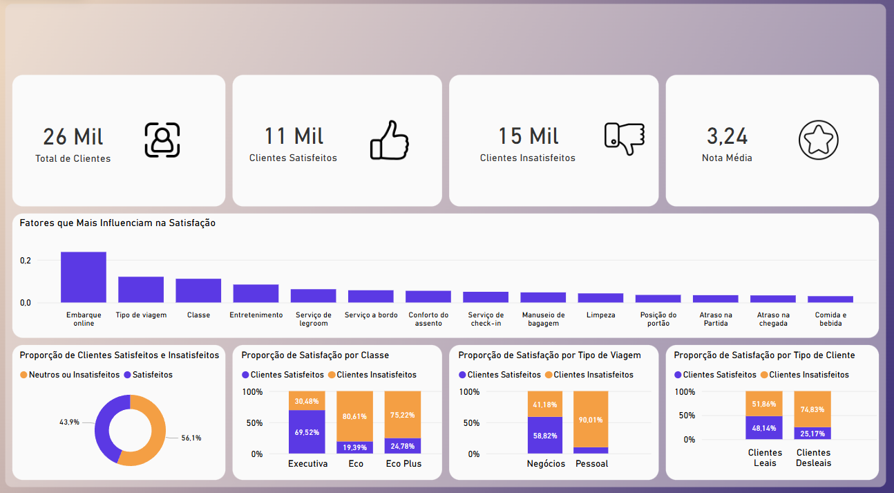

# ✈️ Análise de Satisfação de Passageiros de Companhia Aérea  
Este projeto tem como objetivo analisar os fatores que influenciam a satisfação dos clientes de uma companhia aérea, utilizando técnicas de análise exploratória, visualizações interativas e modelo preditivo baseado em Random Forest.  

# 📊 Ferramentas Utilizadas  
Python (Jupyter Notebook): Limpeza, EDA e Machine Learning.  

Power BI: Construção do dashboard final com visualizações interativas.  

SQLite: Banco de dados  

Pandas, Seaborn, Scikit-learn: Manipulação, gráficos e modelo preditivo.  

# 🔍 Etapas do Projeto  
1. Pré-processamento e Análise Exploratória  
  Limpeza de dados: tratamento de valores nulos, categorização da satisfação e análise de outliers.  

   Agrupamento de variáveis: notas de serviços e características dos clientes.  

   Cálculo de correlações para identificar variáveis mais relevantes.  

   Testes estatísticos para verificar diferenças entre grupos (gênero, tipo de cliente, classe, etc).  

2. Machine Learning  
  Modelo treinado: Random Forest Classifier  

    Divisão dos dados com estratificação (80% treino, 20% teste).  

    Resultado: Acurácia de 91% na predição de satisfação dos clientes.  

    Extração da importância das variáveis a partir do modelo.  

3. Dashboard no Power BI  
  KPIs principais: total de clientes, satisfeitos, insatisfeitos e nota média.  

    Gráfico com fatores que mais influenciam na satisfação (segundo o modelo).  

    Proporção de satisfação por classe, tipo de viagem e tipo de cliente.  

    Notas médias por serviço e proporções claras com cores distintas.  

# 📌 Principais Insights  
O embarque online é o fator com maior impacto na satisfação.  

Clientes da classe executiva e que viajam a negócios tendem a estar mais satisfeitos.  

Clientes leais são, em média, mais satisfeitos do que clientes desleais.  

A nota média geral foi de 3,24 em uma escala de 0 a 5.  

# 📁 Arquivos  
analise_satisfaction.ipynb: Notebook com toda a análise e modelo de machine learning.  

dashboard.pbib: Arquivo do Power BI com o dashboard interativo.  

dataset.csv: Conjunto de dados original (Kaggle).  

airline_satisfaction.db: Banco de dados  

shema.sql: Esquema do banco de dados  

README.md: Este arquivo.  

# 📷 Captura do Dashboard  

# 📚 Fonte dos Dados  
Airline Passenger Satisfaction - Kaggle  
https://www.kaggle.com/datasets/teejmahal20/airline-passenger-satisfaction
